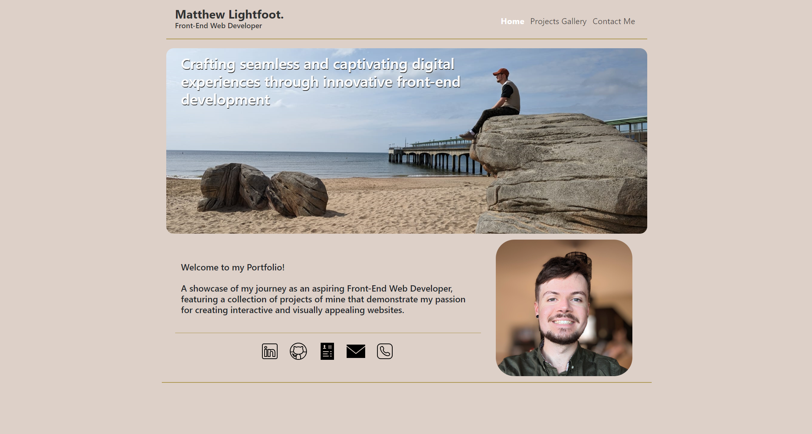
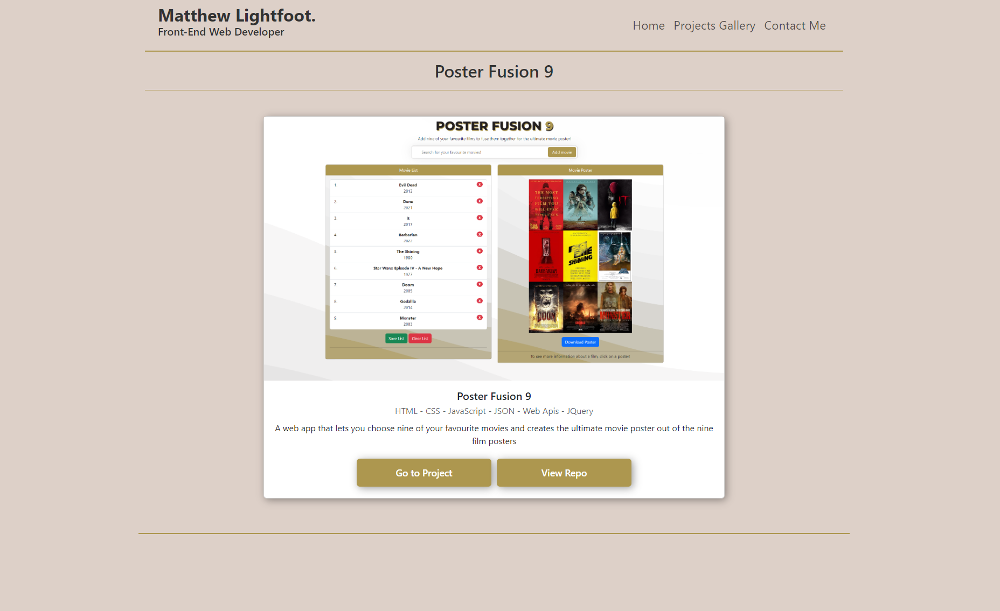

# React Portfolio

## Description
This project is a personal Portfolio that is created using React and showcases my skills and previous projects I have done to potential employers.

## Table of Contents

* [Installation](#installation)
* [Usage](#usage)
* [License](#license)
* [Contributing](#contributing)
* [Tests](#tests)
* [Questions](#questions)

## Installation
There is no installation needed

## Usage
To use the Portfolio website you can click one of the selections in the Navbar to take you to the relevant page. On the Project gallery you can click on more details of any Project to take you to more details of said Project. On this page you can click go to Project to be taken to the website or you can click view repo to view the repo for that Project. On the contact me page you can click on the various links to take you to my LinkedIn, Resume or Github. If you click email it will take you to your email to contact me and if you click phone it will phone my phone number. There is also a contact me section where you can fill in the details to be sent to me and then click submit.

## Screenshot

## License
Ths project is licensed under the MIT license.

## Contributing
To contribute to the repo please get in contact with the repo owner, the details are below

## Questions
If you have any questions about the repo, open an issue or contact me directly at M-lightfoot@hotmail.com. You can find more of my work at [Mtlightfoot](https://github.com/Mtlightfoot).
